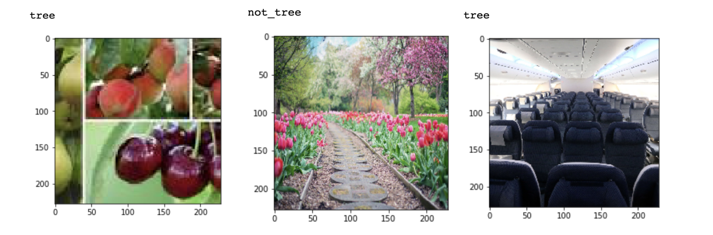

# Using Convolutional Neural Networks for Image Detection

## Tools Used 
Python, TensorFlow, Keras, Scikit-learn, NumPy, Pandas

## Introduction
In this project, I build several Convolutional Neural Networks to sift through photos and detect images that contain trees. The models consist of one baseline and five VGG19 CNNs, all of which are compared to determine the best performer.

## Baseline Model
- Accuracy: 87.5% 
- Loss: 39.9%

## VGG19-1
- Accuracy: 92.30% 
- Loss: 55.10%

## Reasons for Misclassification 
- Blurry and unsharpened images 
- Images with plants that resemble trees
- Trees in the distance

## Examples of Missclassified Images

